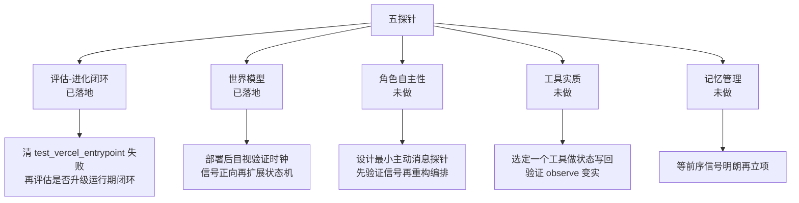

# 反思：我们的游戏距离「Agent 游戏」还有多远 Spec

## Why

用 `ai-agent-book` 对 Agent 的定义框架（Agent = LLM + Context + Tools；ReAct 环；Harness 工程 = Constrain/Verify/Correct；Workflow vs Autonomous；评估-进化闭环；多智能体协作）来审问这款《绝命毒师》角色扮演游戏。我们不问「它是不是 Agent」，而问「它在哪些维度上已经站在 Agent 的土地上，哪些维度还只是搭了台、没有演戏」。

这份 spec 不是功能清单，是一次架构级的诚实体检。它决定下一轮该把力气花在「加强已有的台」还是「补上真正缺的戏」。

## 现状：我们已拥有的 Agent 地基（先诚实登记，别只数短板）

对照书本公式，逐项盘点：

- **LLM（推理引擎）**：`BaseCharacter` 每个角色都有独立 system prompt + `respond_structured` 结构化输出，是真正的角色 Agent 而非单一聊天机器人。
- **Context（工作集）**：静态前缀（system prompt + 工具定义）+ 动态轨迹（对话历史 + dossier 关系记忆 + 滑动窗口）。`dossier_context` 注入跨会话关系状态，符合「静态前缀 + 动态轨迹」范式。
- **Tools（动作接口）**：`ToolRegistry` + 原生 function calling（DEC-0001），`_run_with_tools` 实现了完整的 ReAct 环（reason → act → observe），带 MAX_TOOL_ROUNDS 熔断。
- **Harness（约束/验证/纠正）**：这层比预想的强。`scenes/`（action_ontology、state_reducer、validator、critic）对幻叙述做了世界一致性校验和节拍打分——这是书本第六章「轨迹验证」的雏形。`speak_sanitize` 做输出清洗，`narrative_contracts` 做行为契约。
- **世界模型**：`continuity_board` 有 shared_facts、open_tensions、irreversible_costs、player_relation、present_cast——已经具备「持久世界状态」的骨架。
- **多智能体**：Director 编排 + Crew 群聊模式，`mckee_story` 做大纲/节拍规划。

一句话：**我们的 ReAct + Context + Tools 三层地基是扎实的，Harness 的 Verify 层也有真东西。** 这不是「啥都没有」的差距，而是「有地基、缺了灵魂」的差距。

## 差距：离「Agent 游戏」还差什么

以下是审问出的核心缺口，按「致命程度」从高到低。

### 缺口 1：核心循环是 Workflow，不是 Autonomous Agent（最致命）

书本讲得很清楚：Workflow 的路径是代码预定义、确定的；Autonomous Agent 的路径由运行时根据环境反馈动态决定。

我们的 Director 是**强编排者**：它决定每个 beat 谁说话、谁思考、谁行动、场景怎么切。角色是「被点名才上场」的演员，不是「自己决定下一步」的 Agent。DEC-0005 的 Turn Proposal（private_goal / fear / relationship_tactic / speech_act / subtext / action）给了角色**一回合内的自主**，但**没有跨回合的自主**——角色不会因为上回合的失败自己改策略，不会主动推动自己的目标，不会因世界事件而发起行动。

反映到书本的术语：**我们的角色缺「环境反馈驱动的行为循环」。** 角色不读世界状态、不为自己设立目标、不因结果调整策略。这是「Workflow 型叙事引擎」和「Agent 游戏」最本质的分水岭。

### 缺口 2：Tools 是叙事道具，不是改变世界状态的动作接口

书本：Tools 是「影响外部世界的动作接口」，动作空间里的操作会改变观察空间里的状态。

我们的工具（`lab_pressure_simulator` 等）是**虚构叙事道具**——它们不产生真实的、可查询的世界状态变更。`world_state_delta` 是 LLM 生成的叙事文本，不是结构化状态更新。工具执行后，观察空间没有真正变化，所以「reason → act → observe」的 observe 环节是**空的**——observe 不到真实反馈，角色就无法真正从结果中学习。

这是书本第一章「ablation 实验」的教训：没有 tool result 反馈，Agent 会原地打转。我们的工具给了「动作的形」，没给「动作的果」。

### 缺口 3：没有评估-进化闭环（游戏不会从游玩中学习）

书本第八章：Agent 从「能完成任务」到「能可靠工作」的跨越，靠的是**持续的轨迹评估 → 学习 → 更新**闭环。

我们有一个离线的一致性评估系统（21 个测试、4 维 rubric），但那是**开发期评测**，不是**运行期学习**。游戏不会因为玩家反复在某处卡住而自我改进；角色不会因为一百次「同样失败」而改变策略；没有经验知识库、没有从轨迹中提炼规则的机制。

书本一句话戳中要害：**「保存经验 ≠ 从经验中学习」。** 我们保存了 dossier（世界样貌），但没保存「什么条件下该怎么做」（行为经验）。这是「知识的游戏」和「会成长的 Agent 游戏」的分界线。

### 缺口 4：多智能体是「共享上下文轮转」，不是「产生新信息的协作」

书本第十章的金标准：多智能体只有在**引入单 Agent 无法获得的新信息**（执行反馈、视觉反馈、工具反馈）时才真正有价值；「不同 Agent 辩论同一段文本」不会带来新信息，通常不优于单 Agent。

我们的 Crew 群聊是**共享上下文下的轮流发言**——所有角色看到同一段历史，各自基于同一信息发表意见。这属于书本说的「没有新信息增益」的协作模式。它可能好看，但**不是聪明的多智能体系统**。

### 缺口 5：世界模型是叙述摘要，不是结构化、可查询、带因果约束的状态

书本：世界模型 = 位置、物品、时间、全局事件，是 Agent 观察空间的一部分。

我们的 `continuity_board` 是**LLM 提炼的叙事摘要**（shared_facts 是字符串数组），不是结构化、可查询、带因果约束的状态机。没有时间流逝模型，没有物品/经济系统，没有「A 发生则 B 必须成立」的硬因果约束。角色无法「查」世界，只能「读」摘要。这限制了观察空间的上限。

## 已具备但不充分（半满的杯子）

- **Harness 的 Verify 层**：`scenes/` 已做世界一致性校验，但它是**单点校验**，未形成「校验失败 → 纠正 → 重放」的闭环。
- **Context 的跨会话记忆**：dossier 存在，但无可检索的历史会话索引、无 RAG、无结构化记忆分层。
- **世界的持久性**：`irreversible_costs` 是个好概念，但只停留在叙事层面，未驱动后续行为的约束。

## 评估-进化闭环：PenguinHarness 的启示

用户提示了 [Prism-Shadow/penguin-harness](https://github.com/Prism-Shadow/penguin-harness)，我深挖了它的自进化实现——它完美贴合书本第八章的框架，是绝佳的设计参考。

### PenguinHarness 对我们缺口 3 的匹配度

它的核心自进化闭环：
1. **`benchmark-design`**：设计 benchmark，多 Case 拆分，statement（公开给目标 Agent）和 rubric（私有评分标准）分离，多次 Pilot 校准后冻结，输出 Formal Baseline。
2. **`agent-evaluation`**：每个 Case × Run 隔离运行，把结果记进 scoreboard，用 protocol YAML 返回，保证格式稳定。
3. **`agent-optimization`**：建立 Reference（当前最佳版本）→ 诊断得分 → 提出假设 → 生成 Candidate → 全 Case 并行评估 → 得分严格高于 Reference 才接受 → 接受后追加到 scoreboard → 快照版本方便回滚。
4. **回滚机制**：快照存档，得分不升即回滚，不累积坏版本。

这套设计完全契合 ai-agent-book 第八章「三层验证（outcome → process → quality）」和「验证完再演进」的原则。**它的 loop 形状可以直接复用**。

### 我们应该如何利用它？

**结论：直接原生实现，不做 SDK 集成**。理由：

1. 它是 TypeScript 编写的完整桌面/Web 应用，我们后端是 Python/FastAPI。把 TS 运行时拖进来当依赖，集成成本远大于复用设计。
2. 它的设计思想（benchmark 隔离 Case、statement/rubric 分离、只保留得分提升、快照回滚）完全可以在 Python 中实现，而且我们的 domain 是叙事一致性，不是它的任务完成，benchmark 定义也要适配。
3. 它 v0.1.5 刚发布两周，生态还不稳定，生产依赖有风险。

所以正确姿势是：**复用它的 loop 设计，原生实现适合我们叙事 domain 的闭环**，不直接集成它的代码。

## 目标：把它变成「Agent 游戏」意味着什么

不是推翻重来，是把「台」升级成「戏」。按跨境（从低到高）排序：

1. **从 Workflow 到 Autonomous（最致命缺口）**：让 Director 从「决定一切的编导」退化为「仲裁者」，角色从「被点名」变为「自己读世界状态、自己立目标、自己推动行动」。这是定义「Agent 游戏」的命门。
2. **让工具改变世界状态**：把虚构叙事道具升级为真实状态变更——工具执行后写入结构化世界状态，observe 环节拿到真实反馈，形成封闭的 act→observe 环。
3. **建立评估-进化闭环**：参考 penguin-harness 设计，把离线一致性测试升级为运行期轨迹评估，从玩家游玩轨迹中提炼「可用经验」，写入可检索的知识库或规则，让游戏会成长。
4. **让多智能体产生新信息**：让角色拥有各自独立的观察空间（非共享上下文），通过共享世界状态而非共享同一段文本协作，从「同台辩论」到「不同信息源协作」。
5. **把世界模型结构化**：从叙述摘要升级为带时间、物品、因果约束的可查询状态机，拓宽角色的观察空间。

## Impact

- 受影响能力：角色自主性、工具系统、世界模型、记忆系统、多智能体编排。
- 受影响代码：`backend/agents/director.py`（编排范式）、`backend/agents/characters/base.py`（自主行为循环）、`backend/agents/tools.py`（工具语义）、`backend/agents/continuity_board.py`（世界状态）、`backend/agents/memory.py`（学习闭环）、`backend/agents/mckee_story.py`（大纲联动）。
- 本 spec 为**分析性产出**，不直接改代码；它产出一份差距路线图，供后续以独立 spec 逐项落地。

## ADDED Requirements

### Requirement: 差距分析报告完成
系统 SHALL 提供一份可评审的差距分析，明确「已具备 / 缺口 / 半满」三档，并为每个缺口给出跨境排序与落地建议。

#### Scenario: 完成差距审问
- **WHEN** 对照 `ai-agent-book` 框架逐项核对游戏架构
- **THEN** 产出按致命程度排序的缺口清单，标明每个缺口对应的代码位置与改进方向

### Requirement: 落地路线图可执行
系统 SHALL 将分析转化为有先后依赖、可单独立项的任务序列，避免「一次性推翻重写」。

#### Scenario: 拆分落地
- **When** 开发者需要从差距进入实现
- **THEN** 每个缺口可独立展开为后续 spec，且排序遵循「先自主、再闭环、后协作」的依赖关系

---

## 五探针决策档案（2026-08-04）

> 定位：这是五个缺口的「决策档案」，不是功能清单。回答三个问题——为什么值得投这五个地方、怎么用最便宜的方式验证、验证完该不该升级成重投入。可直接喂给下一轮 PM Intake。
> 排序三把尺子：**可逆性**（改坏了能不能回滚）、**地基验证**（是不是更上游的地基）、**信号强度**（验证结果能不能真的指导决策）。

### 总览

| 探针 | 验证的缺口 | 探针假设 | 便宜设计（最小可验证） | 状态 |
|------|-----------|---------|----------------------|------|
| 评估-进化闭环 | 缺口 3：系统不会从游玩中学习 | 系统能区分叙事「好/坏」，是进化闭环的地基 | 纯后端：剥离关键词模拟退化版 prompt，验证 rubric 能否压分 | ✅ 已落地 |
| 世界模型 | 缺口 5：世界模型是叙述摘要，非可查询状态 | 给角色一个可查的世界时钟，叙事更立体 | 前后端：`world_clock` 状态 + 时间注入 + 前端 HUD 渲染 | ✅ 已落地 |
| 角色自主性 | 缺口 1：核心循环是 Workflow 非 Autonomous（最致命） | 角色自己推动目标，是「Agent 游戏」的分水岭 | 角色在满足条件时主动推送一条消息 | ⏳ 未做 |
| 工具实质 | 缺口 2：Tools 是叙事道具，不改变可查询世界状态 | 工具执行后写真实世界状态，observe 拿到真实反馈 | 工具执行后写入结构化世界状态 | ⏳ 未做 |
| 记忆管理 | 半满杯：记忆是叙述摘要，无检索、无分层 | 结构化记忆分层 + 可检索，跨会话记忆更可用 | 结构化记忆分层的最小实现 | ⏳ 未做 |

### 逐项明细

#### 1. 评估-进化闭环（已落地）
- **优先级依据**：可逆性最高、信号最强、且是地基验证——没有「区分好坏」的裁判，后面所有进化都无从谈起，故排第一。
- **便宜设计**：纯后端，在 `test_character_consistency.py` 加 `TestEvaluationEvolutionDiscrimination` 测试，剥离关键词模拟「退化版 prompt」，验证 rubric 能否区分原版与退化版的分差。
- **验证结果**：后端 403 通过，1 失败（`test_vercel_entrypoint.py` 依赖表问题，非探针本身）。
- **局限**：自我指涉——剥离关键词的退化版并不能代表真实劣化 prompt 的压分能力，仅能当回归哨兵。
- **代码位置**：`backend/tests/test_character_consistency.py`。
- **下一步**：先清掉 `test_vercel_entrypoint.py` 的预存失败；再决定是否把离线一致性测试升级为运行期轨迹评估（参考 penguin-harness 的 loop 设计）。

#### 2. 世界模型（已落地）
- **优先级依据**：成本低、可回滚，且能验证「观察空间」这条最上游的地基。
- **便宜设计**：前后端。`continuity_board.py` 加 `world_clock` 状态管理，`director.py` 生成 `world_state_delta` 时推进时钟，前端 `App.tsx` 渲染时钟信息 + `.world-clock` 样式。
- **验证结果**：前端 build、lint 通过（存在预存错误）。
- **代码位置**：`backend/agents/continuity_board.py`、`backend/agents/director.py`、`src/App.tsx`。
- **下一步**：部署后目视验证时钟显示与叙事联动；若信号正向，再决定是否扩展为完整的时间/物品/因果状态机。

#### 3. 角色自主性（未做）
- **优先级依据**：这是「Agent 游戏」的命门，但改动深、风险高，探针必须格外便宜。
- **便宜设计**：角色在满足特定条件时主动推送一条消息（而非等 Director 点名），只为验证「角色会不会自己推动目标」。
- **代码位置**：`backend/agents/director.py`（编排范式）、`backend/agents/characters/base.py`（自主行为循环）。
- **下一步**：设计最小主动消息探针，先验证信号，再谈是否重构编排范式。

#### 4. 工具实质（未做）
- **优先级依据**：缺少 tool result 反馈，Agent 会原地打转（ai-agent-book 第一章 ablation 教训）。
- **便宜设计**：让现有虚构工具（如 `lab_pressure_simulator`）执行后写入结构化世界状态，observe 环节能查到真实反馈。
- **代码位置**：`backend/agents/tools.py`（工具语义）、`backend/agents/director.py`。
- **下一步**：先选一个工具做最小状态写回探针，验证 observe 是否真的变实。

#### 5. 记忆管理（未做）
- **优先级依据**：属于「半满杯」优化，非致命缺口，优先级靠后。
- **便宜设计**：结构化记忆分层的最小实现，验证跨会话记忆能否检索、能否分层。
- **代码位置**：`backend/agents/memory.py`。
- **下一步**：待前两个探针与角色自主性探针的信号明朗后再立项。

### 当前决策状态

