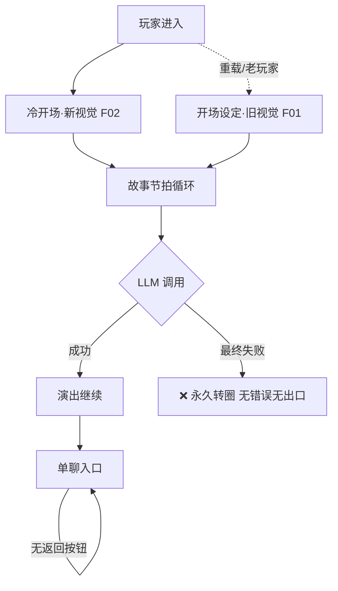

# QA 报告 · 专业玩家全流程实玩（2026-08-27）

> 环境：本地 dev（前端 5176 / 后端 8001）。LLM：StepFun key 欠费 402，全程靠 MiniMax fallback 完成测试。
> 覆盖：简报屏→知识轨道→危机→选角→建会话→3 个故事节拍（chip×1、自由输入×1）→单聊→档案→刷新恢复。
> 未覆盖：TTS 实听、GIF 视觉、SSE 断线重连计费、重演/切换视角（故事在 3 拍后卡死无法继续）。

## 总评

**核心循环是能玩的**：建会话→节拍演出→chip/自由输入→后果回写，全链路真实成立，fallback 链响应快。但**故障呈现是灾难级的**——LLM 一抖，玩家面对的是永久转圈而不是一句话；且产品里并存两套视觉语言、两个入口流程，像两个团队各做半截。

## P0 —— 会赶走玩家的

| # | 问题 | 证据 | 修法 |
|---|---|---|---|
| 1 | **故事节拍静默卡死**：第三拍后“后果正在变化”转圈 80s+。后端 session 已是 `waiting`（拍已完成），前端 SSE 完成事件丢失/未处理，无错误、无出口、无重试 | 日志 14:07:56 minimax 200 后无后续调用；UI 永久转圈 | SSE onerror/oncomplete 兜底：超时 60s 显示“演出中断”+重试按钮；以 session status 轮询对账 |
| 2 | **真故障（所有 provider 挂）时同一静默转圈**，玩家不知道是网络/欠费/崩溃 | 402 被 fallback 掩盖是运气好；最终失败路径无 UI | 错误分类文案（欠费/断网/超时）+ 每类一个出口动作 |
| 3 | **双入口双视觉并存**：重载/老玩家落在旧版「开场设定」浅色纸质页，与新冷开场夜色页是两个产品 | 快照：开场设定页（关系下拉+自由文本）vs 冷开场 | 决定谁是唯一入口，另一个下线或收编（冷开场种子注入 task_prompt 已证明可替代开场设定） |
| 4 | **环境事故即全灭**：本地库未跑 `alembic upgrade head` → 一切建会话失败，前端只给 "⚠ Failed to create session"，无一行提示跑迁移 | 日志 `UndefinedColumnError: owner_token_hash` | 前端文案带自查清单；后端启动时检测 schema 落后并打 WARN |

## P1 —— 明显粗糙的

| # | 问题 | 证据 |
|---|---|---|
| 5 | **导演内部标记漏进玩家 UI**：场景转换卡直接显示 McKee 术语「值: 安全→隐隐不安 — 间隙: …」；分镜卡出现「〔turn_to → Walter〕」 | 第三拍/首拍快照 |
| 6 | **后果面板截断不可读**：「表面平静被杰西的恍…」无展开手段（title 为空） | 首拍后果面板 |
| 7 | **单聊是死胡同**：无可见“返回故事”按钮，唯一出路藏在档案侧栏「回到主页」 | 单聊快照无返回控件 |
| 8 | **HUD 计数不动**：三个节拍后「场次」仍显示“节点 1”；「张力」首屏空白后才有值 | 各拍快照 |

## P2 —— 小刺

| # | 问题 |
|---|---|
| 9 | 行动 chips 连续两拍完全同名（施压追问/先动手/先看清），重复感强——应随剧情轮换 |
| 10 | 语言切换只在冷开场工具条，进入游戏后无入口 |
| 11 | 单聊 GIF figure 空渲染（图片未出） |

## ✅ 工作正常的

- 会话创建/配额端点/SSE 流式演出（前两拍）
- **fallback 链**：stepfun 402 → minimax 无缝接住，延迟可接受
- 单聊全链路：关系选择、开场压力、回复、语音按钮
- chip 行动真实改变剧情走向（厨房戏被玩家的自由输入改写）
- 刷新后 surface/历史恢复（但恢复进了单聊——见 #3/#7）

## 运维动作（立即可做）

1. **StepFun key 欠费**：充值，或把 minimax 提为主 route（省每次 +10s 的 402 重试）
2. 本地/生产库确认 `alembic upgrade head` 已入部署清单（OPS_RUNBOOK 已有，本地这次漏了）

## 建议修复顺序

#1/#2（SSE 可靠性+错误呈现）→ #3（入口统一）→ #5（术语泄漏）→ #7 → 其余。
