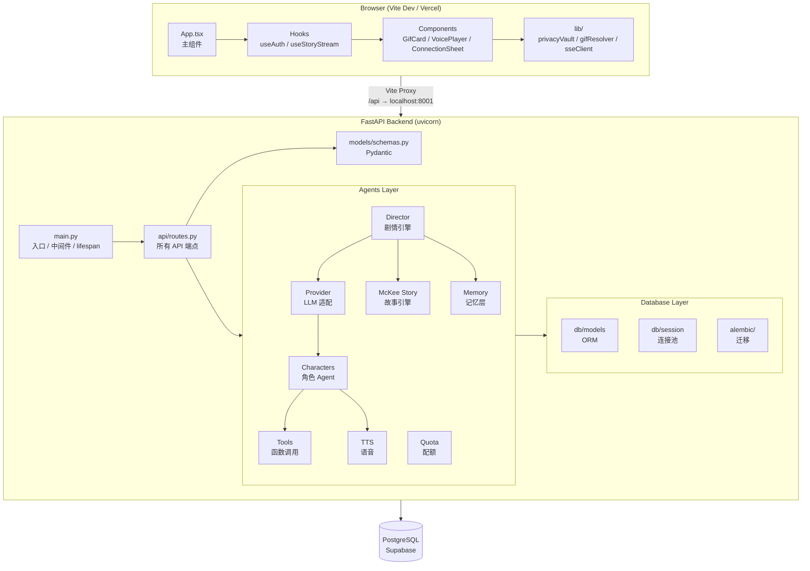

# 整体架构

## 系统架构图



## 分层说明

### 1. 前端层 (React SPA)

- **入口**: `src/main.tsx` → `src/App.tsx`
- **状态管理**: React hooks (`useAuth`, `useStoryStream`, `useCharacterMemory`, `useQuota`, `useConnection`)
- **组件**: `AuthSection`, `ConnectionSheet`, `GifCard`, `VoicePlayer`, `PlotGraphPanel`
- **工具库**: `lib/` — SSE 客户端、隐私保险箱、GIF 解析、语音投射、认证 headers
- **样式**: CSS 变量 tokens + `App.css` + `index.css`
- **角色定义**: `roleProfiles.ts` (角色人格) + `roleAssets.ts` (角色 GIF 资产)

### 2. 后端层 (FastAPI)

- **入口**: `backend/main.py` — lifespan 初始化 ProviderFacade、DirectorAgent 等单例
- **路由**: `backend/api/routes.py` — 所有 REST + SSE 端点
- **Agent 引擎**: `backend/agents/` — 核心 AI 逻辑

### 3. Agent 引擎 (核心)

这是整个项目最复杂的层，负责 AI 对话/剧情推理：

| 模块 | 职责 |
|------|------|
| `provider.py` | LLM 提供商统一适配层 (MiniMax/StepFun/CLIProxy)，支持 tool calling 和 BYOK |
| `director.py` | 剧情 Director — 生成大纲、派发节拍、协调角色 |
| `mckee_story.py` | McKee Story 引擎 v2 — 故事结构理论驱动的大纲/节拍规划 |
| `characters/` | 8 个角色 Agent，继承 `BaseCharacter` |
| `memory.py` | 双层记忆系统 (session-level + world-level dossier) |
| `tools.py` | 原生函数调用框架 (DEC-0001)，提供商无关的 Tool/ToolCall/ToolResult |
| `quota.py` | 免费额度管理 + IP 限流 |
| `tts.py` | MiniMax T2A 语音合成 (克隆语音) |
| `voice_casting.py` | 角色 → 克隆语音 ID 映射 |

### 4. 数据库层

- **ORM**: SQLAlchemy 2.0 async
- **迁移**: Alembic
- **连接**: asyncpg + async session factory
- **模型**: Session, Message, CharacterState, CharacterDossier

### 5. 部署层

- **主生产**: Docker VM (121.89.90.68) — Nginx 反代 + Let's Encrypt TLS
- **前端捷径**: Vercel (仅静态文件)
- **双轨部署**: 改 API / quota / TTS / 迁移 → 必须重建 VM；纯 UI 至少 Vercel

## 数据流 (Story 模式)

```
用户输入任务提示
    │
    ▼
DirectorAgent._generate_outline()  →  LLM 生成 McKee 故事大纲
    │
    ▼
DirectorAgent._render_beats()       → 逐一处理每个节拍
    │
    ▼
DirectorAgent._process_beat()       → 调用角色 Agent 生成回复
    │
    ▼
SSE 事件流推送给前端
(beat_ready / agent_speak / scene_change / agent_think / dossier_update)
    │
    ▼
前端 useStoryStream hook 解析 SSE 事件并更新 UI
```

## 设计模式

| 模式 | 应用位置 |
|------|----------|
| **Facade** | `ProviderFacade` — 统一 LLM 提供商接口 |
| **Abstract Base** | `BaseCharacter` — 角色 Agent 模板方法 |
| **Registry** | `ToolRegistry` — 函数调用注册/执行 |
| **Strategy** | McKee Story 引擎 + 角色 Policy Turn |
| **Singleton** | DirectorAgent, ProviderFacade (通过 FastAPI lifespan) |
| **Producer-Consumer** | SSE 流 (Director produce → 前端 consume) |
| **Repository** | `db/session.py` — 数据库会话管理 |
| **Two-Tier Memory** | World-level (跨会话) + Session-level (单会话) |