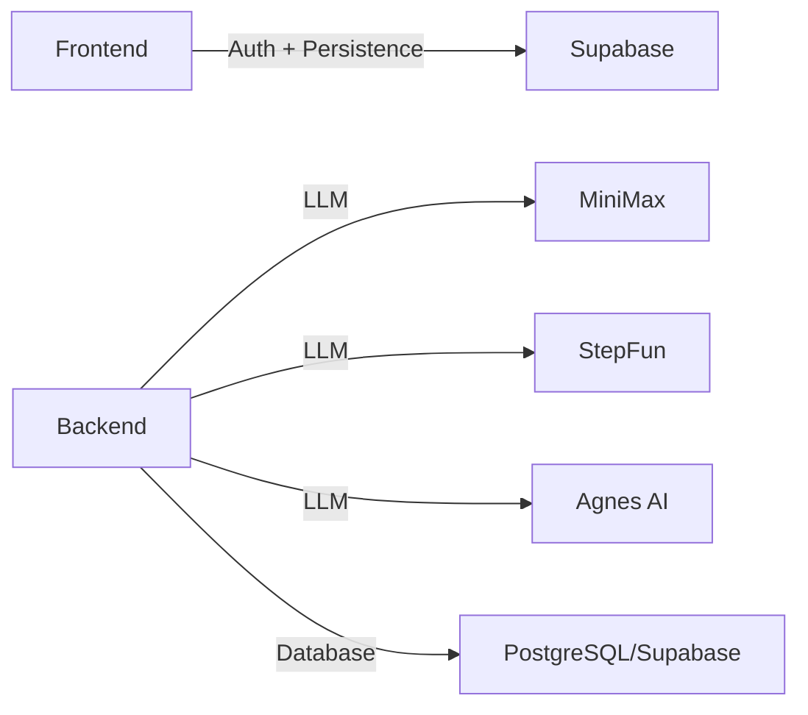

# 依赖关系

## 1. 前端依赖

文件：`[package.json](../../package.json)`

### 运行时

| 包 | 用途 |
|----|------|
| `react` / `react-dom` | UI 框架 |
| `@supabase/supabase-js` | Supabase 客户端 |
| `@supabase/ssr` | SSR 辅助 |
| `railway` | Railway CLI（开发/部署工具） |

### 开发时

| 包 | 用途 |
|----|------|
| `vite` | 构建工具 |
| `@vitejs/plugin-react` | React 插件 |
| `typescript` / `typescript-eslint` | 类型检查与 ESLint |
| `eslint` / `eslint-plugin-react-hooks` / `eslint-plugin-react-refresh` | 代码检查 |
| `@types/node` / `@types/react` / `@types/react-dom` | 类型定义 |

## 2. 后端依赖

文件：`[backend/pyproject.toml](../../backend/pyproject.toml)`、`[backend/requirements.txt](../../backend/requirements.txt)`

| 包 | 用途 |
|----|------|
| `fastapi` | Web 框架 |
| `uvicorn[standard]` | ASGI 服务器 |
| `sqlalchemy[asyncio]` | ORM + async 支持 |
| `asyncpg` | PostgreSQL async 驱动 |
| `httpx` | 异步 HTTP 客户端，调用 LLM |
| `pydantic-settings` | 环境变量配置 |
| `python-dotenv` | .env 文件加载 |
| `pytest-asyncio`（dev） | 异步测试 |
| `ruff`（dev） | 代码检查 |

## 3. 外部服务



| 服务 | 用途 | 相关环境变量 |
|------|------|--------------|
| Supabase | 认证、聊天消息持久化、角色记忆持久化 | `VITE_SUPABASE_URL`, `VITE_SUPABASE_ANON_KEY` |
| MiniMax | LLM 调用（Anthropic-compatible） | `MINIMAX_API_KEY` |
| StepFun | LLM 调用（OpenAI-compatible） | `STEPFUN_API_KEY` |
| Agnes AI | 遗留 serverless LLM 调用 | `LLM_API_KEY` |
| PostgreSQL | 后端数据持久化 | `DATABASE_URL` |

## 4. 模块依赖图

### 4.1 后端

```
main.py
├── config.py
├── api/routes.py
│   ├── db.session / db.models
│   ├── agents.director
│   └── models.schemas
├── agents/director.py
│   ├── agents.characters.*
│   ├── agents.provider
│   ├── agents.memory
│   └── models.schemas
├── agents/provider.py
│   └── config.py
├── agents/memory.py
│   └── db.models
└── db/models.py
    └── db.session.Base
```

### 4.2 前端

```
App.tsx
├── components/AuthSection
├── hooks/useAuth
│   └── lib/supabaseClient
├── hooks/useStoryStream
├── hooks/useCharacterMemory
├── lib/persistedState
├── lib/sceneBackgrounds
├── lib/silhouette
├── lib/voiceExamples
├── lib/supabasePersistence
│   └── lib/supabaseClient
└── styles/tokens.css
```

## 5. 关键调用链

### 5.1 聊天模式

```
App.tsx:handleSend
  → fetch('/api/chat')
  → routes.py:chat
  → DirectorAgent.handle_chat_message
  → DirectorAgent._handle_direct_chat / _handle_crew_chat
  → BaseCharacter.respond_structured
  → ProviderFacade.call_model
  → StepFun / MiniMax
```

### 5.2 剧情模式（SSE）

```
App.tsx:handleStartStory
  → fetch('/api/story') 或 /api/session/create + /api/session/{id}/stream
  → routes.py:stream_session
  → DirectorAgent.process
  → _generate_outline → _generate_beat
  → ProviderFacade.call_model
  → agents.memory.update_dossiers
  → AgentEvent SSE stream
```
