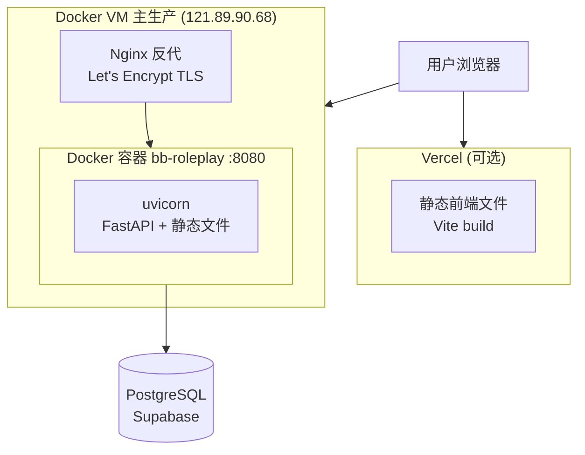

# 部署与运维

## 运行方式

### 本地开发

**前端** (端口 5173):
```bash
npm run dev
```

**后端** (端口 8001):
```bash
cd backend && uvicorn main:app --reload --port 8001
```

Vite 开发服务器自动代理 `/api` 请求到 `localhost:8001`。

### 构建

**前端构建**:
```bash
npm run build        # tsc -b && vite build
```

**生产运行**:
```bash
npm run preview      # Vite preview (纯前端)
```

### 测试

```bash
npm test                    # 前端单测 (tsx)
cd backend && uv run pytest # 后端单测
npx playwright test         # E2E 测试
```

## 部署架构



### 双轨部署策略

| 变更类型 | 部署方式 | 说明 |
|---------|---------|------|
| 纯前端 UI | Vercel + VM | Vercel 快速上线，有需要时也更新 VM |
| API / Quota / TTS | 必须重建 VM | 后端逻辑变更不能只走 Vercel |
| 数据库迁移 | 必须重建 VM | Alembic upgrade head 在容器启动时执行 |
| 配置变更 | 必须重建 VM | .env 文件更新后重启容器 |

## Docker 部署

### Dockerfile ([Dockerfile](file:///Users/mahaoxuan/Desktop/黑客松/breaking-bad-roleplay/Dockerfile))

**两阶段构建**:
1. **Stage 1 (frontend-build)**: Node 20 slim → `npm ci` → `npm run build` → 产出 `dist/`
2. **Stage 2 (runtime)**: Python 3.12 slim → pip install 依赖 → 复制后端代码 + 前端 dist → `start.py` 启动

**构建参数**:
```bash
# 注入 Supabase 公钥 (Vite 构建时环境变量)
ARG VITE_SUPABASE_URL=
ARG VITE_SUPABASE_PUBLISHABLE_KEY=
```

**启动命令**:
```bash
CMD alembic upgrade head && python3 start.py
```

### VM 部署流程

```bash
# 1. 构建并推送
rsync -avz --exclude 'node_modules' --exclude '.venv' ./ root@121.89.90.68:/opt/breaking-bad-roleplay/

# 2. 重建容器
ssh root@121.89.90.68
cd /opt/breaking-bad-roleplay
docker build -t bb-roleplay .
docker stop bb-roleplay && docker rm bb-roleplay
docker run -d --name bb-roleplay -p 8080:8080 --restart unless-stopped bb-roleplay

# 3. 验活
curl https://bb.yishuziyu.cn/api/health
```

## Vercel 部署

### vercel.json

```json
{
  "functions": {
    "api/index.py": { "maxDuration": 60, "excludeFiles": "..." }
  },
  "routes": [
    { "src": "/api/(.*)", "dest": "/api/index.py" },
    { "handle": "filesystem" },
    { "src": "/(.*)", "dest": "/index.html" }
  ]
}
```

**Vercel 入口**: `api/index.py` — 将 backend 路径加入 sys.path 后导入 `main.app`

**部署命令**:
```bash
vercel --prod --yes
```

注意: `.vercelignore` 控制上传体积 (~100MB 上限)

## 部署后验活

每次上线后，打开 https://bb.yishuziyu.cn 做 60 秒 smoke test:

1. 页面加载正常 (无白屏/404)
2. 角色选择可用
3. Direct Chat 发送消息正常
4. Story 模式 SSE 流正常
5. TTS 语音播放正常
6. 移动端布局正常

## 运维注意事项

- **Nginx**: 不要动同机 `gun.yishuziyu.cn` 的 Nginx 配置
- **日志**: Docker 容器日志用 `docker logs bb-roleplay` 查看
- **数据库**: 迁移用 `cd backend && alembic upgrade head`
- **证书**: Let's Encrypt 自动续期
- **新踩坑**: 同一会话内补进 `docs/OPS_RUNBOOK.md`，不要只留在对话里