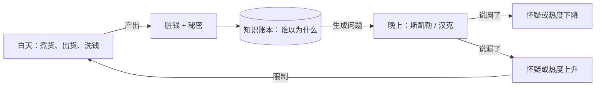
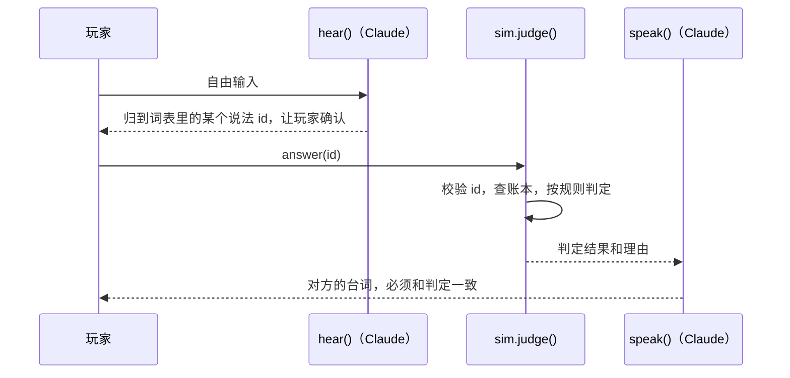

# ABQ 账本 · 设计说明

这份文档写给接手的人（和 Agent）：代码里看不出来的"为什么"。怎么跑、目录在哪，看 [README.md](README.md)。

可玩版本：https://claude.ai/artifact/Gm5ivAPDmvs3dQ4wsNsR61（私有，只有仓库主人能打开）

---

## 1. 为什么推倒重来

旧的 `breaking-bad-roleplay` 重心放在"让 AI 演得像"：`backend/agents/director.py` 3355 行，`src/App.tsx` 2504 行。游戏本身只是 `src/features/game/one_night.json` 里一个 6 回合的选项菜单。

AI 角色扮演天然无限自由，而游戏需要约束。所以要回答的问题不是"做成什么类型"，而是**让玩家和什么约束对抗**。

## 2. 从 Pilgrimage 学的东西

参考：https://github.com/tomjohndesign/pilgrimage 。它的许可证是非商业源码可见，所以这里只学模式，没有拿它的代码和素材。

| Pilgrimage 的做法 | 在这里对应的是 |
|---|---|
| `stepSim(state, dt)` 纯推进，渲染只读状态 | `sim.ts` 的 `step(state, command)`；UI 和渲染从不改状态 |
| 禁止 `Math.random()`，全部从种子派生 | `rng.ts`，RNG 的状态就存在 `GameState.rng` 里 |
| 数值集中在 `balance.ts`，另有调参页 | `balance.ts` 加上 `scripts/playtest.ts` |
| 每条规则一个小文件，各自带测试 | `stories.ts`（说法词表）、`sim.ts`（规则）、`sim.test.ts` |
| 一个名望值控制进度 | 反过来用：热度越低越好，但产量越大越难压 |
| 建筑会召唤人口 | 每个经营动作都会召唤"知情者"或留下证据 |
| 画面上像素大小统一 | 360×212 的软件光栅器，按整数倍放大 |

美学也跟着 Pilgrimage：深色的外框，中间是一块被照亮的等距小模型。另外参考了 MiniTown 的夜景，白天和黑夜的切换正好对应"白天经营、晚上圆谎"。

## 3. 核心设计：白天经营，晚上圆谎

原作的核心是这句话：**帝国越大，要撑的谎越多。** 这里把它直接做成了机制。

- **洗钱是两层之间的桥。** 脏钱在白天能花，但在晚上是负担。洗车店一边是经营上的瓶颈（洗得慢、要抽成），一边又让"钱是洗车店赚的"成为一个真能站住的说法。
- **坦白是一条路，但有代价。** 对斯凯勒说实话，她会变成同谋：怀疑值清零，洗车店由她管账（额度更高、抽成更低）。代价是每笔货她扣下 20% 给孩子，而且不许你再用索尔的门路。对汉克说实话，直接被捕。

## 4. 最重要的约束：AI 不写状态

这是整个架构的底线，改之前请先读这一节。

- `hear()` 只能从 `stories.ts` 的固定词表里挑一个 id，或者判为 `evasive`。sim 会再校验一次，id 不合法就当作回避。
- 玩家在"就这么说"之前能看到 AI 把他的话归成了哪一种，听错了可以直接改选。
- `judge()` 的判定顺序：
  1. 回避；
  2. 坦白；
  3. 和对这个人说过的版本矛盾；
  4. 和对另一个人说过的版本不一致，并且被玛丽传过来了（概率 50%）；
  5. 说法和当前世界不符，比如还没有洗车店却说"洗车店赚的"；
  6. 对方去核实了（概率随同一说法的使用次数上升）；
  7. 以上都没有，就是信了。
- `speak()` 拿到的是已经定好的判定，提示词里要求它不得推翻。拿不到 Claude 时用 `CANNED` 里的现成台词，玩法不变。

**为什么这样设计：** 如果让 AI 来判"信不信"，同一句话今天信、明天不信，玩家学不到规律，也就没有策略可言。旧项目最后也走到了"服务器判定、AI 改不了规则"这一步，这里只是把它当成了起点。

## 5. 平衡现状

四种脚本玩家各跑 300 个种子（`npm run playtest`）的结果：

| 脚本玩家 | 通关率 | 主要死法 |
|---|---|---|
| greedy：只管赚钱 | 约 0% | 被捕（95%） |
| careful：会避风头、陪家人、给杰西钱 | 约 45% | 时间到了钱不够 |
| confess：谨慎，而且适时对斯凯勒坦白 | 约 60% | 时间到了钱不够 |
| random：乱按 | 0% | 时间到了钱不够 |

调的过程中踩过的坑：
- **给家里的钱太多**：一开始炸鸡店一批货就值 $736k，一次出货几乎直接通关。后来把价格降下来，让洗钱成为瓶颈（原作也是这样）。
- **经济会卡死**：钱全洗干净之后，脏钱为零，买不起原料。现在买原料和给杰西分钱会先花脏钱，不够再动干净的钱。
- **斯凯勒没威胁**：怀疑值平均只有 24。后来加了每周 +2 的自然增长，"信了"也只减 6。
- **坦白是必胜策略**：代价加上之前，坦白组 84% 通关，谨慎组 45%。现在是 60% 对 45%。

这些都是脚本玩家的数字。真人会用自由输入，结果会不一样，要靠实际试玩再调。

## 6. 还没做 / 没测到

- [ ] **夜里的 Claude 对话没有实际跑过。** `sample` 这个能力只在 claude.ai 的 Artifact 里可用，开发环境测不到。离线模式（选现成说法）和整局流程已经在无头浏览器里跑通。
- [ ] 汉克只会问"晚上去哪了"和"杰西是谁"。两人说法的交叉检查只发生在这两个话题上，偏少。
- [ ] 没有汉克的晚饭局。设想是热度高时触发，同一晚两个人都在场，一次得同时满足两个人。
- [ ] 存档用的是 `localStorage`，在 Artifact 里只存在当前浏览器，换设备就没了。
- [ ] 原作的名字和角色只能在私有环境里用。要公开，必须换成原创的人物和城市。

## 7. 给接手 Agent 的规则

1. **不要让 AI 写状态**，也不要让 AI 的输出绕过 `judge()`。要加新说法，就加到 `stories.ts` 的词表里。
2. **sim 里不许出现 `Math.random()`**，随机一律用 `roll(s)`，否则回放和存档都会坏。
3. **改了数值就跑 `npm run playtest`**，并把结果分布更新到第 5 节。
4. **新规则要带测试**，写在 `sim.test.ts` 里，覆盖到判定层面。
5. **像素大小必须统一。** 所有画面都画在 `Raster` 里，不要在 canvas 上直接画带抗锯齿的东西。
6. 发布成 Artifact 的步骤：`npm run build`，产物是 `dist/abq-ledger.html`，发布时要声明 `sample` 能力。
