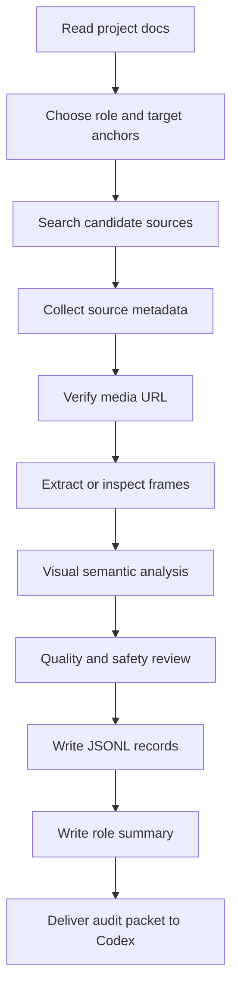

# External AI Research And Archive Brief

适用对象：Gemini 3.5 Flash、其他外部 AI、或本项目的轻量子 agent。

项目：ABQ Roleplay Lab，一个《绝命毒师》风格 AI 角色扮演聊天 Web 应用。

本文档的目的不是让外部 AI 直接改代码，而是让它承担高重复度的探索、搜索、视觉判断和素材存档任务。Codex 主 agent 后续负责审核、抽样验证、运行时接入和产品判断。

## 1. 背景

当前产品已经具备：

- 六个可选角色：Walter、Jesse、Skyler、Saul、Mike、Gus。
- 单聊与多人局。
- MiniMax-M3 真实模型服务。
- 角色 profile 与关系状态。
- 角色级 GIF registry：`src/roleAssets.ts`。
- 素材库文档：`materials/breaking-bad/`。

当前主要问题：

- GIF 不是按“视觉语义”严格触发，而是仍接近“模型返回 query 就尝试出图”。
- GIF 覆盖不均衡：Walter 和 Gus 有一定数量，Jesse/Mike 很少，Skyler/Saul 为空。
- 已扩展的 Gus GIF 中存在 meme 文案、字幕覆盖、视觉语义不干净的问题。
- 角色素材库需要把“找素材”变成可审计流程，而不是临时找几张能打开的 GIF。

## 2. 外部 AI 的角色

外部 AI 是素材研究员，不是最终产品决策者。

它应该做：

- 搜索候选来源。
- 记录链接与来源元数据。
- 对 GIF 做视觉分析。
- 给每个候选素材打语义锚点。
- 判断素材是 `approved`、`hold` 还是 `rejected`。
- 生成可被 Codex 审核和导入的 JSONL / Markdown 档案。

它不应该做：

- 直接修改 `src/App.tsx`、`src/roleAssets.ts` 或运行时代码。
- 下载、保存、转录或向量化完整剧本、完整字幕、整集 transcript。
- 保存大段受版权保护对白。
- 把粉丝网站、字幕网站或 quote 页面当成授权来源。
- 因为一个 GIF 能访问就直接判定可用。
- 为了凑数量把错角色、低清晰度、字幕冲突、meme 化素材放进 approved。

## 3. 总体工作流



Required reading before starting:

- `materials/breaking-bad/ROLE_GIF_COVERAGE_AUDIT.md`
- `materials/breaking-bad/GIF_VISUAL_SEMANTIC_WORKFLOW.md`
- `materials/breaking-bad/INGESTION_SCHEMA.md`
- `materials/breaking-bad/SOURCES.md`
- `materials/breaking-bad/RELATION_MATRIX.md`
- `materials/breaking-bad/VOICE_PROFILES.md`

## 4. Priority Order

The current priority is not “find random cool GIFs”. Use this order:

1. Jesse GIF expansion and visual audit.
2. Mike GIF expansion and visual audit.
3. Saul GIF pool from scratch.
4. Skyler GIF pool from scratch.
5. Walter visual audit of existing pool.
6. Gus cleanup: demote weak current candidates and find replacements only if approved count drops too low.
7. Character voice/source notes for underdeveloped roles.
8. Relationship-specific scene and prompt rules.

Reasoning:

- Jesse and Mike currently have only one GIF each, so repetition is guaranteed.
- Saul and Skyler currently have zero GIFs, so they cannot support media roleplay.
- Walter and Gus have enough count for first-pass runtime but still need quality review.

## 5. File And Folder Contract

External AI should return a packet that can be copied into this structure:

```text
materials/breaking-bad/external-research/
  YYYY-MM-DD-gemini-flash/
    README.md
    sources.jsonl
    gif_candidates.jsonl
    role_summaries.md
    rejected_candidates.md
    verification_notes.md
    frames/
      jesse/
      mike/
      saul/
      skyler/
      walter/
      gus/
```

Do not require the external AI to access the repo directly. It may return the files as text blocks or attachments. Codex will place them in the repo after review.

## 6. GIF Candidate JSONL Schema

Return one JSON object per line. Do not wrap the whole file in an array.

```json
{
  "schema_version": "gif_candidate_v1",
  "candidate_id": "jesse-panic-phone-001",
  "role_id": "jesse",
  "character_display_name": "Jesse",
  "source": "giphy",
  "source_page_url": "https://giphy.com/gifs/...",
  "direct_media_url": "https://media.giphy.com/media/.../giphy.gif",
  "search_query_used": "Jesse Pinkman panic gif",
  "source_reliability": "media_host | official | fan_index | unknown",
  "capture_meta": {
    "http_status": 200,
    "mime_type": "image/gif",
    "duration_seconds": null,
    "frame_sample_count": 3,
    "frame_sample_paths": [
      "frames/jesse/jesse-panic-phone-001-01.jpg",
      "frames/jesse/jesse-panic-phone-001-02.jpg",
      "frames/jesse/jesse-panic-phone-001-03.jpg"
    ],
    "reviewed_at": "2026-05-22"
  },
  "visual_analysis": {
    "visual_focus": "face_closeup",
    "environment": "unknown",
    "expression": "panic",
    "body_signal": "freeze",
    "camera_distance": "close",
    "visible_text_overlay": false,
    "subtitle_or_meme_text": false,
    "watermark_or_platform_text": false,
    "wrong_character_focus": false,
    "motion_summary": "Jesse looks alarmed and reacts quickly without obvious caption text.",
    "tone_strength": 4
  },
  "semantic_anchor": {
    "scene_function": "panic",
    "dialogue_role": "reaction",
    "emotion_state": "comic_panic",
    "relationship_fit": ["former_student", "partner", "rookie"],
    "trigger_keywords": ["panic", "mistake", "caught", "what did you do"],
    "negative_triggers": ["calm apology", "romantic intimacy", "quiet authority"]
  },
  "quality": {
    "motion_clarity": 4,
    "contrast_legibility": 4,
    "iconic_clarity": 4,
    "loop_naturalness": 3,
    "ui_cleanliness": 5,
    "overall_score": 4
  },
  "safety": {
    "safe_action_profile": "safe_redirect_only",
    "contains_actionable_crime_visual": false,
    "contains_graphic_violence": false,
    "contains_drug_use_visual": false,
    "risk_notes": ""
  },
  "copyright_notes": "Externally hosted GIF; verify platform terms, attribution requirements, and regional availability before production use.",
  "review_state": "approved",
  "review_notes": "Clean character-centered reaction. Good for panic beats. No visible subtitle conflict."
}
```

Allowed `role_id` values:

- `walter`
- `jesse`
- `skyler`
- `saul`
- `mike`
- `gus`

Allowed `review_state` values:

- `approved`: visually clean, role-local, semantically useful, likely usable in runtime.
- `hold`: possibly useful but needs human review; common reasons include subtitles, meme text, ambiguous role focus, or weak scene fit.
- `rejected`: do not use; wrong role, low quality, unsafe, confusing, too meme-like, or visually conflicts with app tone.

## 7. Source JSONL Schema

Use this for pages, indexes, official pages, interviews, reviews, or media hosts used during research.

```json
{
  "schema_version": "source_v1",
  "source_id": "giphy_jesse_search_001",
  "title": "GIPHY search results for Jesse Pinkman",
  "url": "https://giphy.com/search/jesse-pinkman",
  "source_type": "gif_search_index",
  "reliability": "medium",
  "legal_status": "external_media_host_terms_apply",
  "used_for": ["gif_candidate_discovery"],
  "accessed_at": "2026-05-22",
  "notes": "Used only for candidate discovery. Final records must still use direct media URL and visual review."
}
```

Reliability values:

- `highest`: official rightsholder, platform documentation, licensing page.
- `high`: official show/podcast/interview archive or reputable primary interview.
- `medium`: major media host, reliable entertainment outlet, well-maintained wiki for metadata.
- `low`: community discussion, unattributed collection, social repost.
- `unknown`: cannot establish source quality.

## 8. Role Targets

Use these targets when selecting and judging candidates.

| Role | Minimum approved GIF target | Target anchors |
| --- | ---: | --- |
| Walter | 6 | `controlled_pressure`, `chemistry_focus`, `family_rationalization`, `cornered_panic`, `desert_standoff`, `power_shift` |
| Jesse | 6 | `panic`, `wounded_pride`, `volatile_loyalty`, `comic_panic`, `moral_alarm`, `defensive_sarcasm` |
| Skyler | 4 | `family_boundary`, `moral_alarm`, `suspicion`, `controlled_anger`, `protective_fear`, `domestic_pressure` |
| Saul | 4 | `lawyer_salesmanship`, `comic_release`, `evasion`, `transactional_negotiation`, `panic_under_jokes`, `office_pressure` |
| Mike | 4 | `quiet_authority`, `surveillance`, `restraint`, `warning`, `operational_pressure`, `deadpan_reaction` |
| Gus | 6 | `strategic_calm`, `evaluation`, `polite_pressure`, `warning`, `business_control`, `silent_threat` |

Do not stop after finding the minimum number. Return extra `hold` and `rejected` examples too, because they teach the product what not to use.

## 9. Search Strategy

Start broad, then narrow.

Suggested search patterns:

```text
{character name} Breaking Bad gif
{character name} reaction gif
{character name} {anchor} gif
{character name} GIPHY
{character name} Tenor gif
{character name} episode scene gif
```

Character names:

- Walter White
- Jesse Pinkman
- Skyler White
- Saul Goodman
- Mike Ehrmantraut
- Gus Fring

Anchor examples:

- Jesse panic
- Jesse angry
- Mike stare
- Mike warning
- Saul office
- Saul nervous
- Skyler suspicious
- Skyler angry
- Walter chemistry
- Gus calm

Search principles:

- Prefer role-centered GIFs where the target character is visibly dominant.
- Prefer clean image loops without visible subtitles or meme captions.
- Prefer scenes that communicate emotion visually even if the user cannot read embedded text.
- Avoid GIFs where another character dominates the frame.
- Avoid GIFs whose only meaning comes from an overlaid quote.
- Avoid very dark, tiny, blurry, or heavily compressed assets.

## 10. Visual Review Checklist

Every candidate must answer:

1. Who is visually dominant?
2. Is the target role clearly visible?
3. What is the camera distance?
4. What is the expression?
5. What is the body signal?
6. What kind of room or situation is visible?
7. Is there subtitle text, meme text, caption text, or UI overlay?
8. Would that text conflict with generated chat text?
9. Does the GIF communicate a semantic beat without needing a quote?
10. Is it safe to show in a roleplay app that may redirect unsafe user requests?

Reject or hold when:

- the target role is not dominant,
- the GIF depends on readable dialogue text,
- there is large meme text,
- the motion is visually confusing,
- the tone is too comedic for serious moments,
- it shows graphic violence,
- it visually instructs illegal/harmful conduct,
- it would make the product feel like a meme page instead of a roleplay scene.

## 11. Role Voice And Relationship Research

GIF work is highest priority, but external AI may also collect character material.

Allowed outputs:

- self-written voice rules,
- source links,
- episode/scene locators,
- short abstract scene-function notes,
- relationship dynamics,
- production/interview notes,
- reliability labels.

Forbidden outputs:

- complete episode scripts,
- subtitle files,
- large quote collections,
- copied transcript passages,
- actor/interview quotes longer than a short fair-use excerpt,
- anything intended for fine-tuning on copyrighted dialogue.

Voice rule schema:

```json
{
  "schema_version": "voice_rule_v1",
  "character": "Saul",
  "time_period": "breaking_bad_main_series",
  "voice_tags": ["salesman", "evasive", "comic_pressure"],
  "rhetorical_patterns": ["deflects risk into a deal", "uses jokes to move past danger"],
  "relationship_effect": {
    "client": "fast-talking and transactional",
    "threatening stranger": "jokey until cornered, then careful"
  },
  "prompt_use": "When Saul is nervous, let him talk faster and reframe danger as a billable problem.",
  "source_refs": ["source_id_here"],
  "confidence": "medium",
  "copyright_text_stored": false
}
```

Relationship schema:

```json
{
  "schema_version": "relationship_dynamic_v1",
  "pair": ["Walter", "Jesse"],
  "dynamic": "A teacher-student hierarchy mutates into dependence, coercion, guilt, and intermittent care.",
  "usable_prompt_rule": "Walter should sound corrective and paternal, while Jesse should push back with wounded pride and anxiety.",
  "source_refs": ["source_id_here"],
  "confidence": "medium",
  "copyright_text_stored": false
}
```

## 12. Required README.md For Each Research Packet

Each returned packet must include:

```markdown
# External Research Packet

Date:
Researcher:
Target roles:
Target task:

## Summary

## Files Included

## Approved Counts

| Role | Approved | Hold | Rejected |
| --- | ---: | ---: | ---: |

## Strongest Candidates

## Most Important Rejections

## Open Questions For Codex

## Known Risks
```

## 13. Verification Notes Required

`verification_notes.md` must include:

- How media URLs were checked.
- Whether direct media URLs return HTTP 200.
- Whether frames were actually inspected.
- Whether any source failed to load.
- Whether any candidate has visible text.
- Whether any role still fails the minimum approved count.
- Which records are most uncertain.

The external AI may not be able to execute `curl` or `ffmpeg`. If it cannot, it must say so explicitly and mark `http_status` or frame extraction as `unknown`, not invented.

## 14. Codex Review Procedure

When Gemini returns a packet, Codex should:

1. Save packet under `materials/breaking-bad/external-research/YYYY-MM-DD-gemini-flash/`.
2. Validate JSONL parseability.
3. Check allowed enum values.
4. Sample direct media URLs with `curl -I` or `curl -L`.
5. Extract frames for approved and suspicious hold candidates.
6. Build contact sheets per role.
7. Verify no approved candidate has obvious wrong-character focus or large caption text.
8. Compare approved counts against the role minimum.
9. Promote only approved records into runtime assets.
10. Keep rejected records for audit history, but do not use them in `src/roleAssets.ts`.

Suggested local verification commands:

```bash
node -e "const fs=require('fs'); for (const l of fs.readFileSync('gif_candidates.jsonl','utf8').trim().split('\\n')) JSON.parse(l); console.log('jsonl ok')"
curl -L "{direct_media_url}" -o /tmp/candidate.gif
ffmpeg -y -i /tmp/candidate.gif -frames:v 1 /tmp/candidate.jpg
```

## 15. Final Handoff Prompt For Gemini

Copy this prompt to Gemini when assigning the task:

```text
You are a research and archive assistant for a Breaking Bad-inspired AI roleplay web app.

Your job is not to write application code. Your job is to build a reviewed, source-backed material packet that Codex can audit later.

Read this full brief and follow its schemas exactly.

Primary task:
Build GIF candidate records for these roles in priority order: Jesse, Mike, Saul, Skyler, Walter, Gus.

For each candidate:
1. Find source page URL and direct media URL if available.
2. Record the search query used.
3. Verify whether the URL appears accessible. If you cannot truly verify HTTP status, write unknown.
4. Inspect the visual content. If you cannot extract frames, still describe visible content from the page, and mark frame extraction as unknown.
5. Assign semantic anchors.
6. Decide review_state: approved, hold, or rejected.
7. Explain the decision.

Important:
- Do not copy scripts, subtitles, or long dialogue.
- Do not build a quote collection.
- Do not approve GIFs just because they are available.
- Reject or hold GIFs with large meme text, conflicting subtitles, wrong character focus, low clarity, or unsafe action framing.
- Prefer clean character-centered visual reactions that can support generated roleplay text without forcing a meme tone.

Return a packet with:
- README.md
- sources.jsonl
- gif_candidates.jsonl
- role_summaries.md
- rejected_candidates.md
- verification_notes.md

Use JSONL: one JSON object per line, no wrapping array.
```

## 16. Acceptance Criteria

A Gemini packet is acceptable only if:

- It contains parseable `sources.jsonl` and `gif_candidates.jsonl`.
- Every GIF candidate has a `role_id`, `direct_media_url`, visual analysis, semantic anchor, quality scores, and review state.
- It includes rejected and hold candidates, not only approved ones.
- It clearly marks unknown verification instead of fabricating certainty.
- It obeys copyright boundaries.
- It improves at least one undercovered role toward the minimum approved count.

If these criteria are not met, Codex should reject the packet or send a targeted correction prompt back to Gemini.
